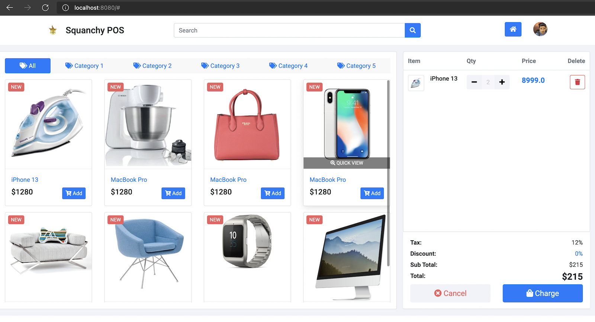

# WebPOS

The demo shows a simple POS system in MVC architecture, which replaces the shell interface in aw02 with a pos web ui (https://github.com/bshbsh404/simple-pos-ui
).



To run

```shell
mvn clean spring-boot:run
```

Currently, it just lists the products for sale with a cart with one item (just for demonstration). 

Please read the tutorial at  https://www.baeldung.com/spring-boot-crud-thymeleaf and make the POS system robust and fully functional. You can also refer to other articles, for instance https://www.baeldung.com/tag/thymeleaf/ .


And please elaborate your understanding in MVC architecture via this homework in your README.md.


------

MVC（模型-视图-控制器）模式用一种业务逻辑、数据、界面显示分离的方法组织代码，将业务逻辑聚集到一个部件里面，在改进和个性化定制界面及用户交互的同时，不需要重新编写业务逻辑。

它把软件系统分为三个部分，即

- 模型（Model）：负责存储系统的中心数据。负责业务逻辑实现，负责数据相关操作
- 视图（View）：获取用户输入，向控制器发送处理请求，接收来自控制器的反馈并将模型的处理结果显示给用户
- 控制器（Controller）：接收来自客户的请求，调用模型业务逻辑方法，调用视图显示执行结果

MVC重要特点就是将视图和数据模型的分离，视图和表现逻辑的分离。这种模式的优点为代码高内聚低耦合，容易增加或者改变视图，方便独立地更新每个独立的软件模块，代码易开发易维护，业务逻辑更容易测试。
